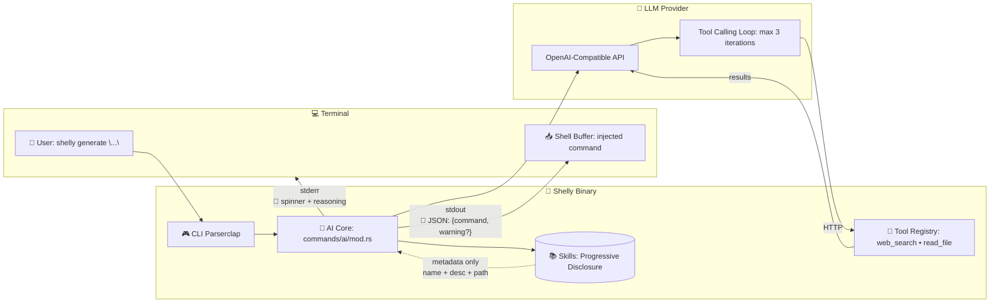

# 🏗️ Shelly Architecture

## Overview

Shelly is an async Rust CLI that bridges natural language and shell execution through a carefully designed I/O split and tool-calling architecture.

## Core Principles

1. **Zero-leak stdout** — Only the final executable command reaches stdout; everything else (reasoning, spinners, errors) goes to stderr
2. **Progressive disclosure** — Skills load lazily; the system prompt only carries metadata
3. **Tool autonomy** — The AI decides when to call tools based on the prompt

## Architecture Diagram



### I/O Flow Detail

```mermaid
sequenceDiagram
    participant User as User
    participant Shelly as Shelly CLI
    participant Skills as SkillManager
    participant LLM as LLM API
    participant Tools as Tool Registry
    participant Shell as Shell Buffer

    User->>Shelly: shelly generate "list files"
    Shelly->>Skills: find_matching_skills(prompt)
    Skills-->>Shelly: metadata [{name,desc,path}]
    Shelly->>Shelly: build_system_prompt(os, shell, skills)
    Shelly->>LLM: send(prompt, tools, json_schema)
    Note over LLM: AI decides if tools needed

    rect rgb(30,30,30)
        Note over Shelly,LLM: Tool Loop (0-3 iterations)
        alt AI requests tool call
            Shelly->>Tools: execute(tool_name, args)
            Tools-->>Shelly: tool_result
            Shelly->>LLM: send(tool_result)
        end
    end

    LLM-->>Shelly: JSON: {command, warning?}
    alt warning present
        Shelly->>User: ⚠️ stderr: warning
    end
    Shelly-->>Shell: stdout: raw_command
    Note over Shell: Shell wrapper injects into buffer
```



## Module Breakdown

### `src/main.rs`
Entry point. Parses CLI with `clap`, dispatches to subcommands:
- `setup` — Config wizard
- `generate` — AI command generation
- `cmds` — List subcommands
- `skills` — Skill management (list, add)
- `completions` — Shell completion generation

### `src/config.rs`
Configuration schema with `serde`:
- `model`, `api_url`, `api_key`
- `shell` (`Bash` | `Zsh` | `Fish`)

Stored via `confy` at `~/.config/shelly/config.toml`.

### `src/commands/ai/mod.rs`
The AI core. Implements:
- **Tool calling loop** (max 3 iterations)
- **Structured output** via JSON schema (`{command, warning?}`)
- **Client initialization** with custom base URL/key

### `src/commands/ai/system_prompt.rs`
- `get_system_prompt()` — Fetches matching skills via `SkillManager`
- `build_system_prompt()` — Pure function assembling Handlebars template + skill metadata

### `src/tools/`

| Tool | Purpose | Status |
|---|---|---|
| `web_search` | DuckDuckGo HTML search for current info | ✅ Active |
| `read_file` | Read files with path security (project/home only) | ✅ Active |
| `ask_user` | Interactive clarification via `dialoguer::Select` | ⚠️ Implemented, disabled |

### `src/skills/`
- **Discovery** — Scan `~/.config/shelly/skills/` for `SKILL.md` files
- **Matching** — Keyword-based on `description` field
- **Progressive disclosure** — Only `name` + `description` + `path` embedded; AI uses `read_file` tool to load full content

### `src/commands/setup/`
Interactive wizard using `dialoguer`:
1. Collect API credentials
2. Select shell type
3. Append wrapper function to `.bashrc`/`.zshrc`/`config.fish`

### Shell Integration
A wrapper function captures stdout and injects it into the shell's editing buffer:
```bash
# Bash/Zsh example
cmd=$(command shelly "$@")
# ... inject $cmd into READLINE buffer
```

## Data Flow

1. User runs `shelly generate "..."`
2. CLI parses args; `call()` loads config
3. `get_system_prompt()` matches skills → builds prompt with OS/shell context
4. Send to AI with tool definitions + JSON schema
5. AI may call tools (web search, read file) in a loop
6. Final response parsed as JSON → extract `command`
7. Optional `warning` printed to stderr
8. Command returned to stdout → shell wrapper injects into buffer

## Security Considerations

- `read_file` restricted to project directory and home directory
- `ask_user` always offers a "Cancel" option
- Warnings for destructive commands (via structured output `warning` field)
- Skills validated before installation (requires `SKILL.md`)
